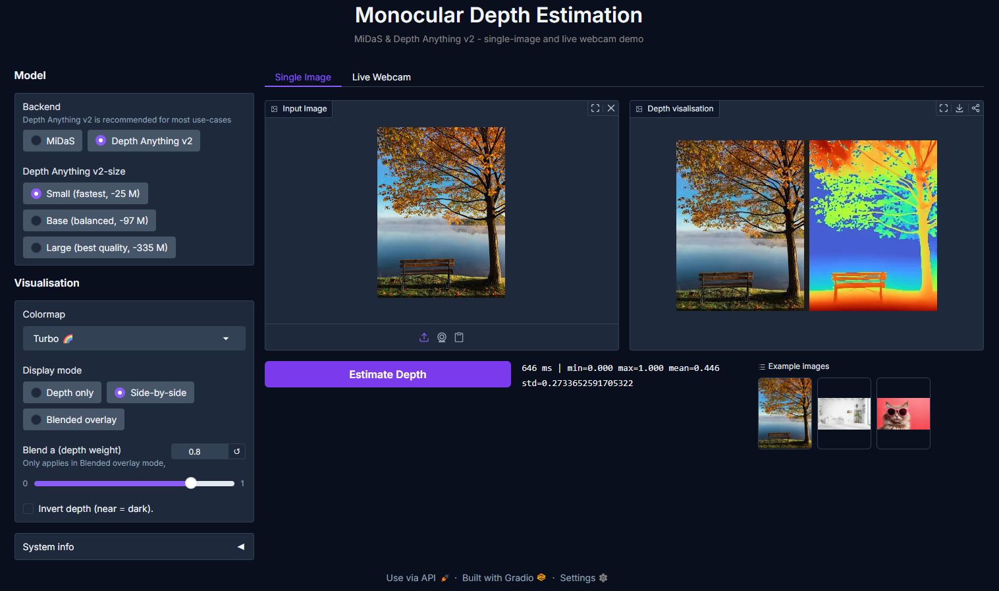
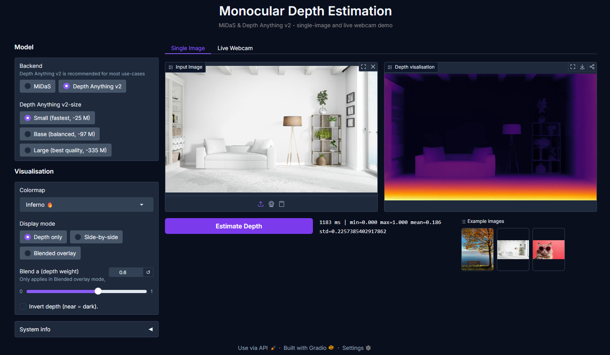
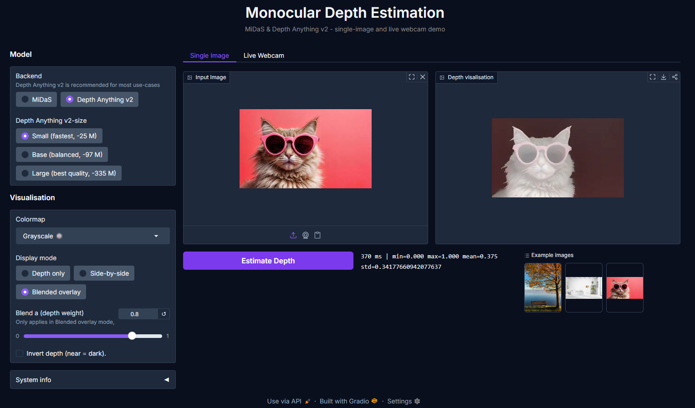
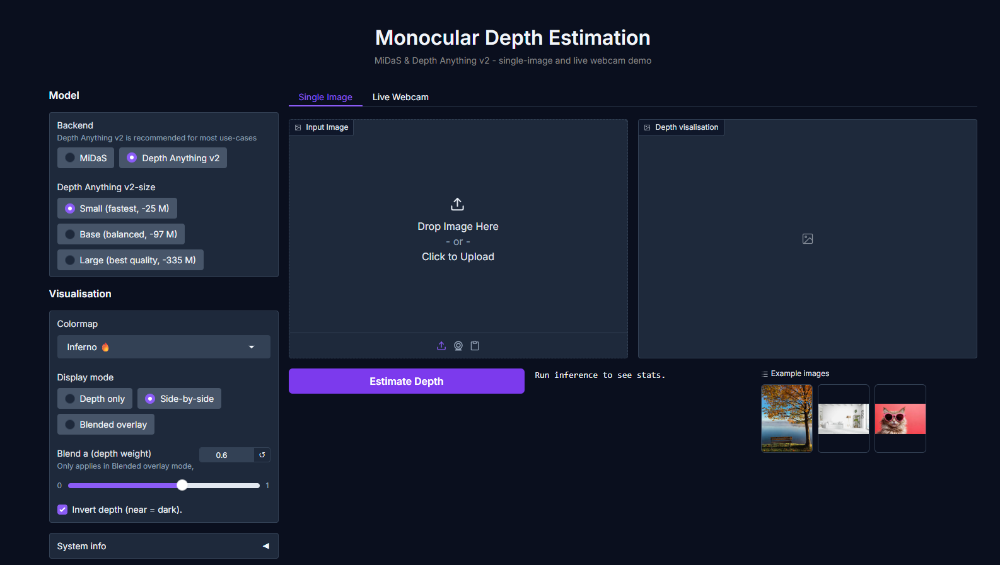

# Monocular Depth Estimation

> AI-Powered monocular depth estimation using MiDaS  and Depth Anthing v2 - upload any image or use your webcam to get a real-time depth map.


---

## What is this?
This proejct uses state-of-the-art momocular depth estimation models to predict depth from a single image - no sterio camera or LiDAR required. Upload a photo or point your webcam, and generates a colourised depth map showing wich parts of the scene are near and far.

It supports two model backends:

- **MiDaS** - reliable and battle-tested, three variants from fast to hight quality
- **Depth Anything v2** - latest generation, superior accuracy, great for real-time webcam use

---

## Demo

``` 
Input:  [ photo of a cit street ]
Output: [ depth map - buildings far/dark, pedestrains near/birght ]
```
Run the app and you get a brower UI like this:










---

## Features

- 🚀**Two model backends** - MiDaS( 3 variants) and Depth Anything v2 (Small/ Base/ Large)
- 📸**Live webcam demo** - real-time streaming in the browser
- 🎨**6 colormaps** - Inferno, Magma, Plasma, Viridis, Turbo, Grayscale
- 💻**3 display modes** - depth only, side-by-size or alpha-blend overlay
- ⚡️**Auto device detections** - runs on CUDA, Apple MPS, or CPU automatically
- 📦**Batch inference CLI** - process hundreds of images via command line
- ⚙️**Configurable** - control colormap , model size, resolution and more via `.env`

---

## Requirement

- Python 3.10 or higher
- pip
- (Optional) NVIDIA GPU with CUDA for faster inference

---

## Inatallation

### 1. Clone the repository

```bash
git clone https://github.com/Chamika-Dilshan-Anuruddha/monocular-depth-estimation.git
cd monocular-depth-estimation
```

### 2. Create and activate a virtual environment

```bash
python -m venv venv

# Windows
venv\Scripts\activate

# macOs/ Linux
source venv/bin/activate
```

### 3. Install the package
```bash
pip install -e .
```

`-e .` means "editiable mode" - the project installs from your local files so any code chage takes effect immediately without reinstalling.

`pip install -e .` registers `depth_estimation` insto the virtual environment itself.

`depth_estimation` package is now treated exactly the same way as third-party libraries - Python has no idea one come from PyPI and the other came from the local `src/` folder.


### 4. (Optional) Install dev dependencies

Only needed if you want to run tests, lint or use Jupyter notebooks.

```bash
pip install -r requirements-dev.txt
```

### 5. Set up environment variables
```bash
cp .env-example .env
```

Edit `.env` to change settings (see [Configuration](#configuration) below).

---

## Usage

### Run the web app

```bash
python -m app.gradio_app
```

Then open **http://localhost:7860** in your browser, upload an image and click **Estimate Depth**.



---

### Live webcam demo

Switch to the **Live Webcam** tab in the app - frames are processed in real-time and the depth map updates continuously. Use `MiDaS_small` or `Depth Anything v2 Small` for smooth frame rates on CPU.

---

### Batch inference via CLI

Process all images in a folder and save depth maps to an output directory:

```bash
python scripts/batch_depth.py --input examples/ --output outputs/
```

Use a specific backend and colormap:

```bash
python scripts/batch_depth.py --input examples/ --backend midas --model DPT_Hybrid --colormap turbo --output outputs/
```

Process images listed in a CSV file (requires a `path` column)

```bash
python scripts/batch_depth.py --csv examples/sample_batch.csv  --output outputs/
```
CLI options:

| Flage | Default | Description |
|---|---|---|
| `--input`  | -  | Folder of images (mutually exclusie with `--csv`)  |
| `--csv`  |  - | CSV file with a  `path` column  |
| `--output`  | `outputs/`  |  Directory to save depth maps |
| `--backend`  | `depth_anything_v2`  | `midas` or `depth_anything_v2`  |
| `--model`  | settings default  | MiDaS variant or DA-v2 size (`vits`/`vitb`/`vitl`)  |
| `--colormap`  | `inferno`  |  `inferno`, `magma`, `plasma`, `viridis`, `turbo`, `gray` |
| `--mode`  | `colour`  |  `colour`, `side-by-side`, or `blend` |
| `--alpha`  |  `0.6` | Blend weight (depth vs original), used in `blend` mode  |
| `--max-dim`  | `1024`  | Resize longest edge before inference  |
| `--no-invert`  | off  |  Near = bright instead of far = bright |


---

### Use as a Pythong library

```python
from depth_estimation import build_estimator, DepthPostprocessor, ImagePreProcessor
from depth_estimation.config import ColormapName

# Load an image
pre = ImagePreProcessor(max_dimension=768)
img = pre.load("../examples/outdoor.jpg")

# Run depth estimation (model downloads automatically on first time)
estimator = build_estimator()    # Depth Anything v2 Small by default
depth = estimator.predict(img)    # float32 H x W array in [0,1]

# Colourise and save
post = DepthPostprocessor(colormap=ColormapName.TURBO, invert=True)
post.save(depth, "outputs/depth.png", original=img, mode="side-by-side")

# Get depth statistics
stats = post.depth_stats(depth)
print(stats)
```
---

## Project Structure

```
monocular-depth-estimation/
|
| -- src/
|     | -- depth_estimation/         # Core library (installable package)
|              | -- model/           # MiDaS and Depth Anything v2 wrappers
|              | -- pipeline/        # Image pre/post processing
|              | -- config/          # Settings via .env / pydantic
|              | -- utils/           # Logger and device detection
|
| -- app/
|     | -- gradio_app.py             # Web UI entry point (image + webcam tabs)
|     | -- components/               # Reusable Gradio UI blocks
|
| -- tests/                          # Pytest unit tests (Currently not available)
| -- scripts/
|      | -- batch_depth.py           # CLI for bulk depth inference
| -- examples/                       # Sample images for testing
| -- notebooks/                      # Jupyter exploration notebooks

```
---

## Configuration

```env
# Which backend to use: "midas" or "depth_anything_v2"
DEPTH_BACKEND=depth_anything_v2

# Depth Anythin v2 size: "vits" (fast), "vitb" (balanced), "vitl" (best quality)
DEPTH_DEPTH_ANYTHING_SIZE=vits

# MiDaS variant: "MiDaS_small", "DPT_Hybrid", "DPT_Large"
DEPTH_MIDAS_MODEL=DPT_Hybrid

# Colormap: inferno, magma, plasma, viridis, turbo, gray
DEPTH_COLORMAP=inferno

# Invert depth so near objects are dark
DEPTH_INVERT_DEPTH=true

# Webcam settings
DEPTH_WEBCAM_DEVICE_ID=0
DEPTH_WEBCAM_WIDTH=640
DEPTH_WEBCAM_HEIGHT=480

# Gradio with UI settings
DEPTH_APP_PORT=7860
DEPTH_APP_SHARE=false

# Logging webosity: DEBUG, INFO, WARNING, ERROR
DEPTH_LOG_LEVEL=INFO
```

---

## How It Works

```
User uploaded image / webcam frame
             |
             V
      ImagePreProcessor      <- load, convert to RGB, resize if needed
             |
             V
    MiDaS / Depth Anything   <- vision encoder predict pre-pixel depth
             |
             V
      DepthPorstprocessor    <- normalise, apply colormap, invert, blend
             |
             V
        Depth map image      <- colourised H x W x 3 uint8 array            
```
---
## Models
|Model | Params | Speed | Quality | VRAM |
| --- | --- | --- | --- | --- |
| MiDaS Small | ~5 M | Very fast | Good | < 1 GB |
| MiDaS DPT-Hybrid | ~123 M | Fast | Great | ~2 GB |
| MiDaS DPT-Large | ~345 M | Moderate | Excellent | ~4 GB |
| Depth Anything v2 Small | ~25 M | Fast | Excellent | ~1 GB |
| Depth Anything v2 Base | ~97 M | Moderate | Excellent | ~2 GB |
| Depth Anything v2 Large | ~335 M | Slow | Best | ~6 GB |


Model are downloaded automatically from HuggingFace on first use and cached in `~/.cache/huggingface/`.

---

## Troubleshooting

**`ModuleNotFoundError`: No module name 'depth_estimation'**
-> Run `pip install -e .` from the project root.

**First run is very slow**
-> Normal -model weights are being downloaded. Subsequent runs use the local cache.

**CUDA out of memory with Large models**
-> set `DEPTH_DEPTH_ANYTING_SIZE=vits` in `.env` or switch to `DEPTH_BACKEND=midas` with `DEPTH_MIDAS_MODEL=MiDaS_small`.

**Webcam not detected**
-> Set  `DEPTH_WEBCAM_DEVICE_ID=1` (or higher) in   `.env` if you have multiple cameras.

**Port 7860 already in use**
-> Set `DEPTH_APP_PORT=7861` in `.env`.


---

## License

This project is licensed under the MIT License - see [LICENSE](LICENSE) for details.

---

## Acknowledgements

- [MiDaS](https://github.com/isl-org/MIDAS)
- [Depth Anything v2](https://github.com/DepthAnything/Depth-Anything-V2)
- [HuggingFace Transformers](https://github.com/huggingface/transformers)
- [Gradio](https://github.com/gradio-app/gradio)

